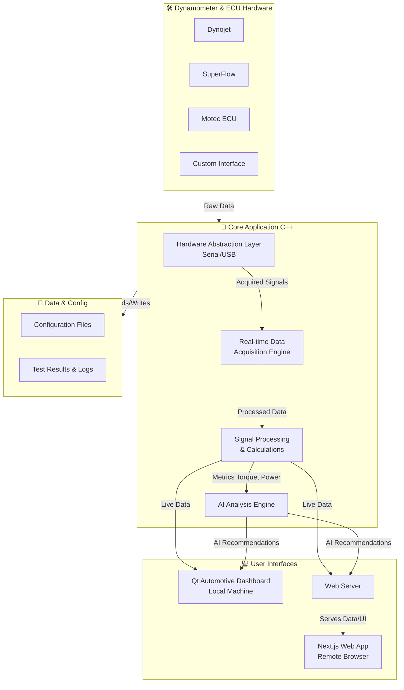
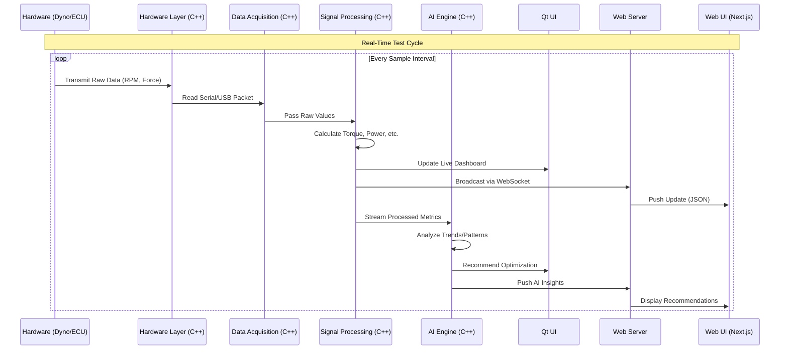
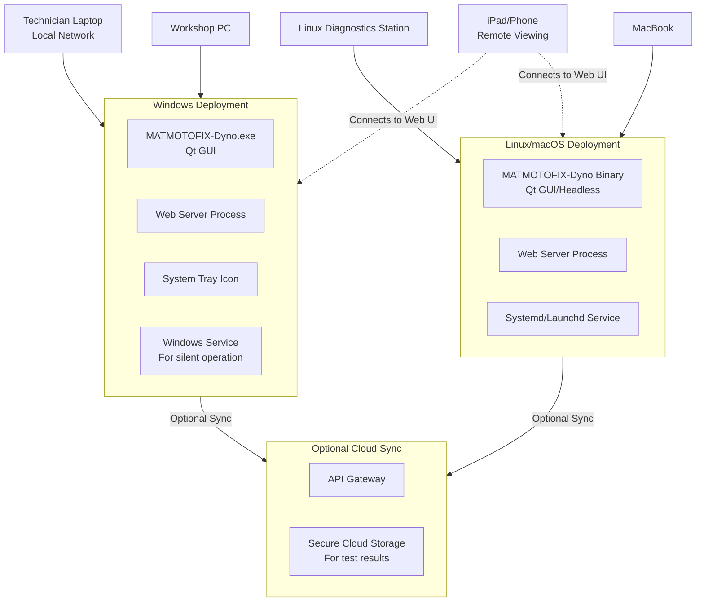

# MATMOTOFIX-Dyno 🏍️💨

[](https://github.com/yourusername/MATMOTOFIX-Dyno)
[](https://github.com/yourusername/MATMOTOFIX-Dyno)


## Table of Contents 📑

*   [Overview](#overview-)
*   [Features](#features-)
*   [Quick Start](#quick-start-)
    *   [Prerequisites](#prerequisites-)
    *   [Build](#build-)
    *   [Run](#run-)
*   [Installation](#installation-)
    *   [Windows](#windows-)
    *   [Silent Install (IT)](#silent-install-it-)
*   [Supported Hardware](#supported-hardware-)
*   [Architecture](#architecture-)
*   [Development](#development-)
    *   [Project Structure](#project-structure-)
    *   [Build Targets](#build-targets-)
*   [CI/CD](#cicd-)
*   [License](#license-)
*   [Support](#support-)

---

## Overview 👀

MATMOTOFIX-Dyno is a comprehensive C++ application with modern web interface for professional motorcycle dynamometer testing. Features real-time data acquisition, AI-powered performance analysis, and multi-platform support.

---

## Features ✨

*   **Real-time Dyno Testing** 📊 - Live RPM, torque, and power measurement
*   **AI Performance Analysis** 🤖 - Intelligent optimization recommendations
*   **Qt Automotive Interface** 🎛️ - Professional automotive-style dashboard
*   **Web-based UI** 🌐 - Modern Figma-inspired interface with 3D visualization
*   **Multi-platform Support** 💻 - Windows, Linux, macOS
*   **Hardware Integration** 🔌 - Dynojet, SuperFlow, Motec ECU support
*   **Professional Installer** 📦 - Windows SDM with driver manmanageme

---

## Development 🛠️

### Prerequisites ⚙️
- CMake 3.21+
- Qt 6.5.0+
- C++17 compiler
- Node.js (for web interface)

### Build & Run 🚀
```bash
cd my-app
mkdir build && cd build
cmake ..
cmake --build . --parallel 4
```

---

## Project Structure 📂

```bash
my-app/
├── src/                 # C++ source code 🖥️
├── app/                 # Next.js web interface 🌐
├── components/          # React components ⚛️
├── scripts/             # Build and install scripts 📜
├── resources/           # Configuration files 🗂️
└── build/               # Build output 📦
```

---

### 4. **Supported Hardware Badges**

Add a row of badges to show off your hardware compatibility.


## Supported Hardware 🔧

[](https://dynojet.com)
[](https://superflow.com)
[](https://motec.com.au)
[](https://github.com/yourusername/MATMOTOFIX-Dyno)

---

## System Architecture ⚙️

This diagram shows the high-level components and how they interact.

**Code (Using Mermaid.js - works on GitHub/GitLab):**



---

### 2. Real-Time Data Processing Flow

This sequence diagram details the journey of data from the hardware to the UI.

**Code (Using Mermaid.js):**



---

### 3. Deployment/Platform Overview

This diagram shows how the software is deployed across different platforms.

**Code (Using Mermaid.js):**



