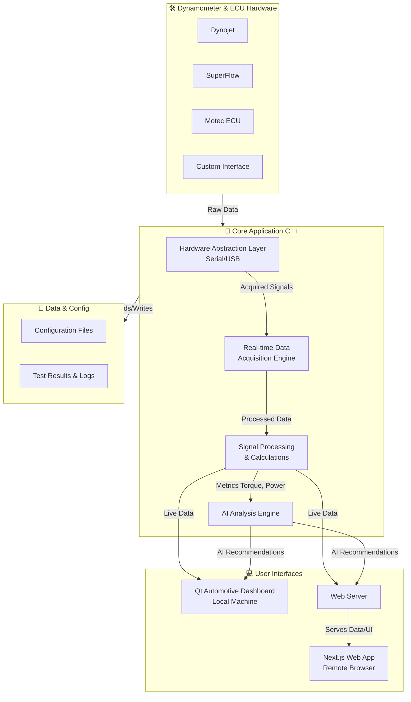
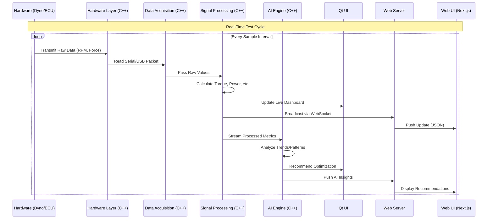

# MATMOTOFIX-Dyno 🏍️💨

[](https://github.com/yourusername/MATMOTOFIX-Dyno)
[](https://github.com/yourusername/MATMOTOFIX-Dyno)
[](https://github.com/yourusername/MATMOTOFIX-Dyno/actions)
[](https://github.com/yourusername/MATMOTOFIX-Dyno)
[](https://isocpp.org/)
[](https://www.qt.io/)
[](https://nodejs.org/)

Professional Motorcycle Dynamometer Software with AI-Powered Analysis.

## Table of Contents 📑

*   [Overview](#overview-)
*   [Features](#features-)
*   [Quick Start](#quick-start-)
    *   [Prerequisites](#prerequisites-)
    *   [Build](#build-)
    *   [Run](#run-)
*   [Installation](#installation-)
    *   [Windows](#windows-)
    *   [Silent Install (IT)](#silent-install-it-)
*   [Supported Hardware](#supported-hardware-)
*   [System Architecture](#system-architecture-)
*   [Development](#development-)
    *   [Project Structure](#project-structure-)
    *   [Build Targets](#build-targets-)
*   [CI/CD](#cicd-)
*   [License](#license-)
*   [Support](#support-)

---

## Overview 👀

**MATMOTOFIX-Dyno** is a next-generation, cross-platform software suite designed for professional motorcycle dynamometer testing. It combines a high-performance C++ core for precise real-time data acquisition with a modern, AI-powered web interface for deep performance analysis and visualization. Engineered for the workshop, it delivers the accuracy professionals demand with the flexibility of modern software.

## Features ✨

*   **Real-time Dyno Testing** 📊 - Live RPM, torque, and power measurement with high-resolution data acquisition.
*   **AI Performance Analysis** 🤖 - Intelligent engine that analyzes data patterns to provide actionable tuning recommendations.
*   **Dual Interface Mode** 🎛️🌐
    *   **Qt Automotive Dashboard:** A robust, touch-friendly interface optimized for the dyno bay.
    *   **Web-based UI:** A modern Next.js application accessible from any device for remote monitoring and advanced 3D result visualization.
*   **Multi-platform Support** 💻 - Native execution on Windows, Linux, and macOS.
*   **Extensive Hardware Integration** 🔌 - Seamless support for Dynojet, SuperFlow, Motec ECU, and custom serial/USB interfaces.
*   **Professional Deployment** 📦 - Enterprise-ready Windows installer with driver management and silent deployment options.

## Quick Start 🚀

### Prerequisites ⚙️

*   **CMake** 3.21+
*   **Qt** 6.5.0+
*   A **C++17** compatible compiler (MSVC, GCC, Clang)
*   **Node.js** 18+ (for developing the web interface)

### Build

```bash
# Clone the repository
git clone <your-repo-url>
cd MATMOTOFIX-Dyno

# Configure and build the core application
mkdir build && cd build
cmake .. -DCMAKE_BUILD_TYPE=Release
cmake --build . --parallel $(nproc) # Use --parallel 4 on Windows
```

### Run

```bash
# Run the C++ Application (starts core & web server)
./MATMOTOFIX-Dyno

# Alternatively, run the web interface in development mode
cd ../app
npm install
npm run dev
# Web UI will be available at http://localhost:3000
```

## Installation 📦

### Windows

For end-users, we provide a seamless installation experience.
1.  Download the latest `MATMOTOFIX-Dyno-Setup.exe` from the [Releases](https://github.com/yourusername/MATMOTOFIX-Dyno/releases) page.
2.  Run the installer. It will guide you through the setup, including installing necessary drivers for your hardware.
3.  Connect your dynamometer hardware and launch **MATMOTOFIX-Dyno** from the Start Menu.

### Silent Install (IT)

For IT administrators deploying to multiple workshop stations.
```powershell
# Run in an elevated PowerShell window
.\silent-install.ps1 -InstallPath "C:\Program Files\MATMOTOFIX-Dyno" -EnableDrivers $true
```

## Supported Hardware 🔧

[](https://dynojet.com)
[](https://superflow.com)
[](https://motec.com.au)
[](https://github.com/yourusername/MATMOTOFIX-Dyno)

*   **Dynojet:** 250i, 450i series
*   **SuperFlow:** SF-1020, SF-1025
*   **Motec:** M800 ECU systems
*   **Custom:** Any device with a USB or Serial interface and a published protocol.

## System Architecture ⚙️

### High-Level Component Overview



### Real-Time Data Processing Flow



## Development 🛠️

### Project Structure 📁

```
MATMOTOFIX-Dyno/
├── src/                 # C++ source code (Core Engine, Qt UI) 🖥️
│   ├── core/           # Data acquisition, processing, AI
│   ├── hardware/       # Hardware abstraction layer (HAL)
│   └── gui/            # Qt Automotive Dashboard
├── app/                # Next.js web application 🌐
│   ├── components/     # React components ⚛️
│   ├── pages/          # Next.js pages
│   └── public/         # Static assets
├── scripts/            # Build and install scripts 📜
│   ├── windows/        # NSIS installer scripts
│   └── deployment/     # CI/CD and silent install
├── resources/          # Configuration files, icons, firmware 🗂️
└── build/              # Build output directory (Generated) 📦
```

### Build Targets

*   `MATMOTOFIX-Dyno`: The main application executable (includes Qt UI and internal web server).
*   `matmotofix-core`: Core library for headless operation (optional).
*   The web interface is built and bundled by `npm run build` and served by the core application.

## CI/CD 🔁

This project uses **GitHub Actions** for automated Continuous Integration and Deployment:
*   **Build Testing:** On every push and pull request, code is compiled on Ubuntu, Windows, and macOS runners.
*   **Release Packaging:** On tag creation, automated builds create standalone binaries and the Windows installer.
*   **Deployment:** Packages are automatically uploaded to the GitHub Releases page.

## License 📄

**MATMOTOFIX-Dyno**  
Copyright © 2025 MATMOTOFIX Technologies. All rights reserved.

This software is proprietary and confidential. Unauthorized copying, distribution, modification, or use is strictly prohibited.

## Support 🤝

For technical support, documentation, and to report issues:
1.  **Documentation:** Please first check the project [Wiki](https://github.com/yourusername/MATMOTOFIX-Dyno/wiki).
2.  **Issues:** For bug reports and feature requests, please use the [GitHub Issues](https://github.com/yourusername/MATMOTOFIX-Dyno/issues) page.
3.  **Discussions:** For questions and community support, head to our [GitHub Discussions](https://github.com/yourusername/MATMOTOFIX-Dyno/discussions) board.

---
*Proudly built with Qt, C++, and Next.js.*
```